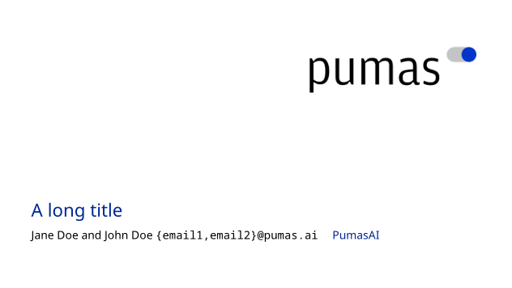
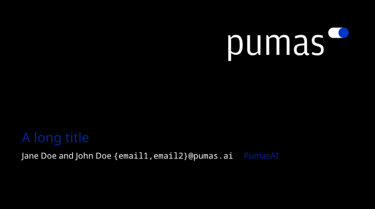

# Pumas Beamer LaTeX Templates

This repository provides a template for $\LaTeX$ slides using the `beamer` package.
This template is based on the [Pure Minimalistic Theme](https://github.com/kai-tub/latex-beamer-pure-minimalistic).
Pumas' logo images and colors are taken from [`PumasAI/CompanyLogos`](https://github.com/PumasAI/CompanyLogos).

## Required Packages

```bash
beamer textpos babel biblatex inputenc csquotes xpatch tikz pgfplots silence appendixnumberbeamer fira fontaxes mwe noto
```

## Light Mode



## Dark Mode



If you are plotting stuff and want to use the dark theme you'll probably want to add this to the preamble:

```latex
\usepackage{pgfplots}
\pgfplotsset{height=7cm,  % only if needed
             width=12cm,  % only if needed
             compat=1.18, % only if needed
             legend style = {fill = black, draw = white}}
```

## License

The Beamer Pure Minimalistic template software is released under the GNU GPL v3.0 [license](LICENSE).
Pumas' logo images and software are copyrighted and all rights reserved.
